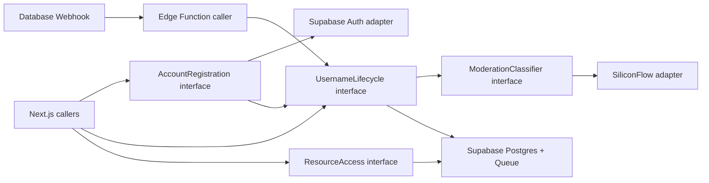

# ADR 0001: Deep Module Design

- Status: Accepted
- Date: 2026-08-17

## Context

The highest-risk behavior is not page rendering. It is the interaction between
username reservations, moderation revisions, queue delivery, LLM failure, and
published-name visibility. If each route, SQL query, and queue handler owns a
piece of those rules, callers must understand the entire state machine and
stale jobs can overwrite newer user intent.

Resource authorization has a separate risk: callers must distinguish anonymous
access, forbidden access, and successful reads while Supabase RLS remains the
final enforcement mechanism.

The design therefore concentrates behavior behind a few interfaces. Pages,
route handlers, server actions, and Edge Function entrypoints remain thin
callers.

## Decision

### Module Map



### AccountRegistration Module

The external seam is a single operation:

```typescript
register(input: {
  email: string;
  password: string;
  username: string;
}): Promise<RegistrationResult>
```

Its interface includes these guarantees:

- Invalid username syntax is rejected before creating an account.
- Successful identity creation is followed by an initial username request.
- A partial failure after identity creation is returned as a recoverable
  account state rather than reported as if no account exists.
- Provider moderation is never awaited by registration.
- Supabase Auth errors are translated into stable domain errors.

The implementation hides input validation order, Supabase Auth calls, profile
readiness, initial username submission, and partial-failure recovery.

`IdentityProvider` is an internal seam because two adapters are justified:
the Supabase Auth adapter in production and an in-memory adapter in module
tests.

Login, logout, and session refresh use Supabase Auth directly. Wrapping those
operations would add a shallow module without hiding meaningful behavior.

### UsernameLifecycle Module

This is the deepest module in the application. Its external seam has three
operations:

```typescript
requestChange(input: {
  actorId: string;
  username: string;
}): Promise<UsernameSnapshot>

retry(input: {
  actorId: string;
}): Promise<UsernameSnapshot>

processAvailable(input: {
  maxJobs: number;
  maxDurationMs: number;
}): Promise<ModerationRunSummary>
```

`requestChange` is used for both the first username and every later edit. Its
interface guarantees:

- Format validation and normalization are consistent for every caller.
- Published and pending reservations remain globally unique.
- The moderation revision increases exactly once for an accepted change.
- Previous pending work becomes stale.
- The published username remains unchanged until approval.
- The new moderation job and profile state become observable together.

`retry` is valid only for the current `error` state. It creates a fresh
revision and queue message for the same pending username. It cannot retry a
rejected or human-review result.

`processAvailable` acquires the worker lease and drains messages sequentially
within explicit job and duration limits. For each message it:

1. Detects stale revisions before calling the LLM.
2. Calls the moderation classifier.
3. Applies the result only if the revision is still current.
4. Publishes and releases reservations atomically on approval.
5. Preserves the published username on rejection, human review, or error.
6. Acknowledges terminal queue messages.
7. Releases or expires the worker lease even after failure.

The implementation hides tables, SQL functions, transactions, queue message
shape, visibility timeout, worker lease mechanics, stale-message handling, and
state transitions. Callers never update moderation columns directly.

### ModerationClassifier Module

The interface is one operation:

```typescript
classify(username: string): Promise<
  | { decision: "approve" | "reject" | "human_review"; reason: string }
  | { decision: "provider_error"; reason: string }
>
```

This is an internal seam of `UsernameLifecycle`. Two adapters make it real:

- SiliconFlow adapter for production.
- Deterministic adapter for tests.

The implementation hides prompt construction, model configuration, timeout,
HTTP transport, structured-output parsing, schema validation, and provider
error normalization. No caller handles raw model text.

### ResourceAccess Module

The external seam is one operation:

```typescript
read(input: {
  actorId: string | null;
  resourceSlug: string;
}): Promise<
  | { kind: "granted"; resource: ResourceDocument }
  | { kind: "unauthenticated" }
  | { kind: "forbidden" }
  | { kind: "not_found" }
>
```

The implementation hides resource lookup, authentication-only access,
explicit permission lookup, and RLS-backed reads. Callers map the result to a
page or HTTP response but never reproduce authorization rules.

Resource A and Resource B are data, not branches in caller code. Their access
mode is stored with the resource so later resources can reuse the same
interface.

### Read Models

The dashboard, username status display, and member directory are read models.
They query RLS-protected database views directly through server loaders.

No separate module is introduced for each read model. Their behavior is a
projection of invariants already owned by `UsernameLifecycle`, and wrapping a
single query would fail the deletion test.

### Database Locality

Atomic username transitions live in versioned Postgres functions called by
`UsernameLifecycle`. Table-specific repository interfaces are rejected.

The database is local-substitutable through a local Supabase stack, so module
tests use the real schema, functions, queue, and RLS policies. Tests do not
replace these with one in-memory repository per table.

### Composition

Dependency construction happens only at runtime entrypoints:

- Next.js server entrypoints construct `AccountRegistration`,
  `UsernameLifecycle`, and `ResourceAccess`.
- The Edge Function constructs `UsernameLifecycle` with the SiliconFlow
  adapter.
- Tests construct the same modules with deterministic external adapters.

Dependencies are accepted by module implementations and are not created inside
domain operations.

## Testing

The interface is the test surface.

### UsernameLifecycle Interface Tests

Run against local Supabase with the deterministic moderation adapter. Cover:

- First username submission and reservation.
- Published-name preservation during rename.
- Approval, rejection, human review, and provider error.
- Retry eligibility and new revision creation.
- Stale job suppression before and after classifier execution.
- Concurrent attempts to reserve the same normalized username.
- Atomic publication and release of the old username.
- Sequential queue processing under concurrent webhook invocation.

These tests assert returned snapshots and externally readable database state.
They do not assert which SQL function or table mutation occurred.

### AccountRegistration Interface Tests

Use the in-memory identity adapter plus the real `UsernameLifecycle` test
fixture. Cover validation ordering, existing email, username conflict,
successful non-blocking registration, and recoverable partial completion.

### ResourceAccess Interface Tests

Run against local Supabase with anonymous, ordinary, and explicitly granted
actors. Cover Resource A, Resource B, missing resources, and direct RLS denial.

### Browser Tests

Use the full application seam for the reviewer workflows: register, observe
pending state, edit a username, access Resource A, receive Resource B denial,
log in with the seeded account, access Resource B, and inspect visible members.

Browser tests do not mock module interfaces. They verify that callers compose
the modules correctly.

## Rejected Alternatives

- One repository interface per table: this would expose storage structure to
  callers and create shallow modules.
- Queue operations exposed to routes: callers would need to understand
  revisions, acknowledgement, and stale messages.
- Raw SiliconFlow responses outside the classifier: prompt and parsing changes
  would spread across the worker and tests.
- Moderation transitions in the Edge Function handler: retries and future
  workers would duplicate the state machine.
- Authorization branches in pages: every new caller could drift from RLS
  policy.
- A generic event bus or workflow engine: no second workflow currently
  justifies that seam.
- A single application-wide module: authentication, moderation, and resource
  access change for different reasons and do not belong behind one broad
  interface.

## Consequences

- Callers learn three small external interfaces rather than the database and
  queue state machine.
- Moderation changes concentrate in `UsernameLifecycle`, improving locality.
- The classifier and identity provider can be tested without live external
  calls.
- Local Supabase is required for meaningful module tests.
- Registration cannot be fully atomic across Supabase Auth and application
  tables. The interface must expose a recoverable partial-completion result.
- The Edge Function must honor a bounded drain duration and worker lease so
  webhook fan-out cannot create parallel LLM calls.
