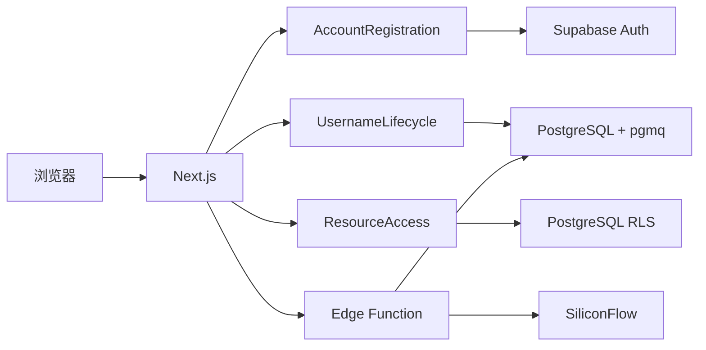

# 用户登录与授权 Demo 交付说明

## 交付信息

- 公网地址：`https://demo.henry070.org`
- Vercel 备用地址：`https://antijailbreak.vercel.app`
- 资源 B 测试邮箱：`resource-b-reviewer@demo.henry070.org`
- 资源 B 测试密码：`Gatehouse-B-2026!`
- 源码仓库：`https://github.com/Gzmomo001/anti_jailbreak`

测试账号仅拥有一条资源 B 显式权限，不具备管理员或 service-role 权限。

## 1. 实现方式与三天时间规划

### 第一天：建立最小闭环

- 建立 Next.js、Supabase Auth 和 PostgreSQL 项目。
- 完成邮箱密码注册、登录、退出登录和受保护工作台。
- 注册时校验用户名格式并立即创建异步审核任务。
- 用户无需等待 LLM 返回即可进入工作台。
- 完成资源 A 登录可读、资源 B 默认拒绝的首个授权闭环。

### 第二天：完成审核状态机和一致性

- 建立持久化审核队列、串行 Worker lease 和 Supabase Edge Function。
- 接入 SiliconFlow，要求模型返回结构化 JSON。
- 支持通过、拒绝、等待人工审核和 provider error。
- 支持任意状态修改用户名，并使用 moderation revision 防止旧结果覆盖新用户名。
- 新用户名审核期间继续展示旧的已发布用户名。

### 第三天：测试、部署和交付

- 完成 RLS、显式资源权限和资源 B 测试账号。
- 执行单元测试、生产构建和桌面/移动浏览器测试。
- 部署 Supabase migration、Edge Function 和 Vercel 应用。
- 绑定 `demo.henry070.org`，完成公网回归测试。
- 整理架构、AI 使用、时间投入和 LLM 调试心得。

## 2. 整体架构与技术栈

### 技术栈

- Web：Next.js 16 App Router、React 19、TypeScript、Tailwind CSS
- Authentication：Supabase Auth
- Database：Supabase PostgreSQL
- Authorization：Server-side `ResourceAccess` + PostgreSQL RLS
- Queue：Supabase Queue / `pgmq`
- Worker：Supabase Edge Function
- LLM：SiliconFlow OpenAI-compatible Chat Completions
- Deployment：Vercel + Supabase
- Testing：Vitest + Playwright

### 模块设计



设计重点不是堆叠框架，而是把高风险规则放在少量深模块中：

- `AccountRegistration` 隐藏 Auth 创建、用户名初始化和部分失败恢复。
- `UsernameLifecycle` 统一处理占用、revision、入队、重试和审核状态转换。
- `ResourceAccess` 统一返回 granted、unauthenticated、forbidden 和 not found。
- `ModerationClassifier` 隐藏 Prompt、超时、HTTP、JSON 解析和 provider error。

### 用户名一致性

Profile 分开保存：

- `published_username`：已经公开展示的名称。
- `pending_username`：正在审核的新候选名称。
- `moderation_revision`：当前候选名称的版本号。

每个审核任务保存用户名快照和 revision。Worker 提交结果前重新比较
revision；旧任务即使已经调用完 LLM，也不能覆盖用户的新修改。

### 授权模型

- 未登录用户不能读取资源。
- 资源 A 的访问模式是 `authenticated`。
- 资源 B 的访问模式是 `explicit`。
- 前端按钮只负责体验，数据库 RLS 是最终授权边界。
- 测试账号只获得资源 B 的一条显式 permission，不具备管理员权限。

## 3. AI Coding 工具与 Token 使用

- 主要工具：OpenAI Codex
- 辅助能力：Image Generation、现代 Web 指南、Playwright、Supabase CLI、
  Vercel CLI
- Token 使用量：约 `120k–180k`，为开发过程中的近似估算，不是账单精确值。
- Token 消耗最多的部分：
  - 用户名 revision、双重占用和旧任务失效的一致性设计。
  - Supabase Queue、RLS、Edge Function 和云端部署诊断。
  - 桌面与移动端界面实现、语义表单和浏览器验证。

AI 主要负责代码生成、资料检索、测试编写和错误定位。架构取舍、权限模型、
验收优先级和最终行为判断由开发者确认。

## 4. 不计模型时，人工时间最多的部分

人工时间最多的部分是云端集成和验收：

- 确认 Supabase Auth、PostgreSQL、Queue、Edge Function 和 Vercel
  之间的真实运行路径。
- 检查 RLS 是否能阻止绕过前端的直接数据读取。
- 复现用户名连续修改和旧任务晚到的竞态。
- 在真实公网环境验证普通账号与资源 B 测试账号的差异。

相比页面开发，这些工作更难交给模型一次性完成，因为必须观察真实外部状态和
运行结果。

## 5. 本场景优先级最高的部分

最高优先级是**服务端和数据库实际执行的授权边界**。

一个看起来完整的登录页面不代表资源安全。如果资源 B 只是隐藏按钮，用户仍然
可以直接请求数据。因此本项目同时使用：

1. Next.js 服务端身份与权限检查。
2. Supabase RLS 数据库策略。
3. 默认拒绝的资源访问模式。
4. 不具备管理员权限的独立测试账号。

LLM 判断效果反而不是第一优先级。题目已经允许判断质量不严格，因此更重要的是
模型失败时不会破坏注册、不会泄漏密钥，并且用户能理解状态和恢复路径。

## LLM 用户名审核调试与优化心得

### 第一版：只问“是否违规”

问题：

- 模型容易返回自然语言段落。
- “有争议”和“明确违规”混在一起。
- 代码需要猜测“可以”“不建议”等措辞。

### 第二版：结构化三分类

将输出约束为：

```json
{
  "decision": "approve | reject | human_review",
  "reason": "简短原因"
}
```

改善：

- 业务状态与模型决定一一对应。
- 不确定样本进入人工审核，而不是被迫通过或拒绝。
- JSON 解析错误可以明确归类为 provider error。

### 第三版：明确规则与低随机性

- 使用较低 temperature。
- 在 system prompt 中列出仇恨、骚扰、色情、暴力威胁、冒充官方等拒绝条件。
- 双关、语境不足和难以确认的名称进入 `human_review`。
- 设置 15 秒超时和输出长度限制。
- 不把原始模型内容直接展示给其他用户。

### 失败处理

- HTTP 错误、超时、无内容、JSON 错误和 schema 错误统一进入 `error`。
- `error` 状态显示管理员邮箱和“重新审核”按钮。
- 重试会创建新的 revision，不复用旧任务。
- 拒绝和等待人工审核不允许普通重试，但用户始终可以修改用户名。

### 实测记录

上线验收使用正常名称、明显违规名称、双关名称和 Prompt injection
风格名称做一轮实测。实际结果在 SiliconFlow 生产密钥配置完成后补充。

## 已完成验证

- `pnpm lint`：通过。
- `pnpm typecheck`：通过。
- Vitest：32 个用户名、注册、结构化输出、状态映射和资源授权测试通过。
- `pnpm build`：Next.js 16 production build 通过。
- Playwright：Vercel 生产地址桌面/移动 Chrome 共 4 个认证页面测试通过。
- 真实 RLS：匿名访问 resources 得到 `42501`；普通账号只能读取 A；
  reviewer 可以读取 A 和 B。
- 真实页面：普通账号读取 A 成功、读取 B 显示 403；reviewer 读取 B 成功。
- 非阻塞注册故障路径：约 3.5 秒进入 Dashboard；后台进入 error；
  管理员邮箱和重试按钮可见；重试产生新 revision。
- 用户名一致性：数据库忽略伪造 normalized 参数；大小写/全角等价名称
  仍保持全局唯一；改名后旧 `pgmq` 消息已删除，新任务留在队列。
- 生命周期：通过、拒绝、人工审核、provider error、error 重试、旧 revision
  抑制和改名后发布均在云端数据库验证通过。

## 上线后验证清单

- [x] 普通用户注册后无需等待 Worker 即进入 Dashboard。
- [ ] SiliconFlow 实际返回通过后，用户名出现在成员目录。
- [x] 拒绝、人工审核和 provider error 状态正确。
- [x] error 可以重试并创建新 revision。
- [x] 改名期间旧用户名继续可见。
- [x] 旧 revision 结果不会覆盖新用户名。
- [x] 普通账号可访问 A，访问 B 得到 403。
- [x] 测试账号可以访问 A 和 B。
- [x] Vercel 备用地址可匿名打开登录页。
- [ ] Cloudflare DNS 指向 Vercel 后，`demo.henry070.org` 可访问。
